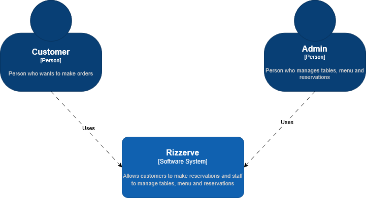
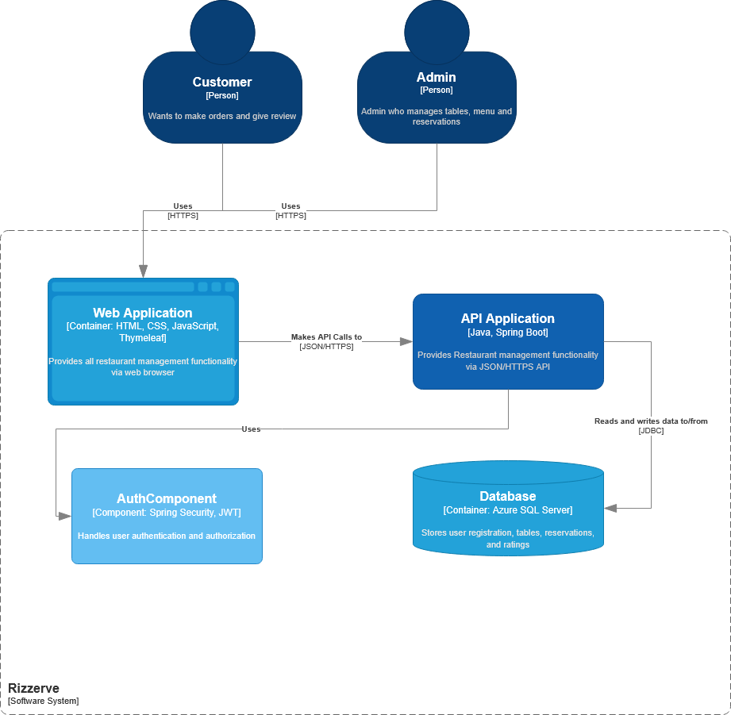
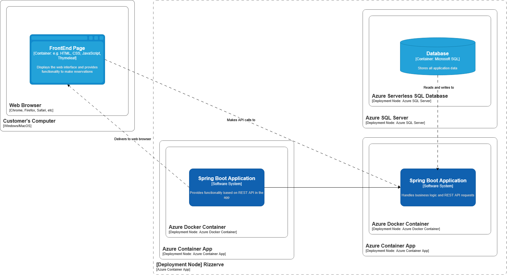
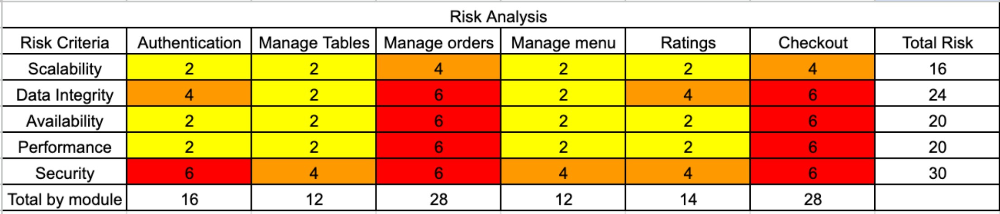

## Group Members:

- Isaac Jesse Boentoro - 2306256362
- Samuella Putri Nadia Pauntu - 2306170446
- Kezia Salsalina Agtyra Sebayang - 2306172086
- Bryant Warrick Cai - 2306256255
- Ferdinand Bonfilio Simamora - 2306256324

## Work/Feature Distribution:
- ALL: Authentication
- Isaac: Manage Tables
- Bryant: Manage Orders
- Samuella: Food Rating
- Ferdinand: Checkout
- Kezia: Manage Menu

## URL(s) to the group project repository:
https://github.com/rizzerve/rizzerve

## URL to the deployed app:
https://rizzerve-deploy.ambitiouswater-27e3bbd0.southeastasia.azurecontainerapps.io/

## URL(s) to the technical documents (the initial design):
https://docs.google.com/document/d/1XfDrTGUXtxLi6n77F-Ivzk7vgRkqt_4X4bSRE_sT4IQ/edit?usp=sharing

## Our group's project current architecture

### Context Diagram

### Container Diagram

### Deployment Diagram

## Our group's RISK ANALYSIS 

## Our group's project architecture after analysis
### Context Diagram

### Container Diagram

### Deployment Diagram

### Explanation of risk storming of the group
After conducting a risk analysis using the Risk Storming technique, we identified security and data integrity as the highest risk factors in our current architecture, especially in modules like Manage Orders and Checkout. These modules deal with sensitive operations such as payments and customer interactions, which, if not logged or monitored, can lead to serious vulnerabilities including unauthorized access, data breaches, or lack of accountability. Despite already having an authentication component, there was no mechanism in place to audit sensitive actions or track security-relevant events like failed login attempts, suspicious API access, or admin privilege abuse.

To address this, we introduced a new component: Security Audit Service. This component is responsible for logging audit trails from the API Application, particularly for high-risk operations involving authentication, rating submissions, order management, and admin actions. The logs are persisted in the existing database but are isolated by function to ensure clean separation of concerns. By integrating this service, we improve traceability, forensic readiness, and compliance with best practices in secure system design. The arrows from the API Application to Security Audit Service, and subsequently to the Database, show this added security workflow.

Overall, this architectural change significantly reduces our project’s total risk score, particularly in the Security and Data Integrity categories. It also aligns with the system’s growth projection by providing a scalable foundation for monitoring and future compliance requirements. The updated container and context diagrams clearly reflect this evolution, ensuring our system is both robust and audit-ready.

## INDIVIDUAL DIAGRAMS
### Food Rating Feature
by Samuella Putri Nadia Pauntu - 2306170446

#### CODE DIAGRAM

#### COMPONENT DIAGRAM

### Manage Menu Feature
by Kezia Salsalina Agtyra Sebayang - 2306172086

#### CODE DIAGRAM

#### COMPONENT DIAGRAM

### Checkout Feature
by Ferdinand Bonfilio Simamora - 2306256324

#### COMPONENT DIAGRAM

#### CODE DIAGRAM

