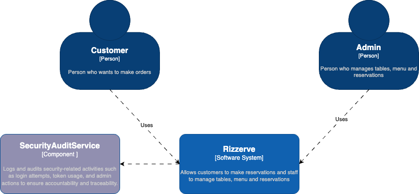

## Group Members:

- Isaac Jesse Boentoro - 2306256362
- Samuella Putri Nadia Pauntu - 2306170446
- Kezia Salsalina Agtyra Sebayang - 2306172086
- Bryant Warrick Cai - 2306256255
- Ferdinand Bonfilio Simamora - 2306256324

## Work/Feature Distribution:
- ALL: Authentication
- Isaac: Manage Tables
- Bryant: Manage Orders
- Samuella: Food Rating
- Ferdinand: Checkout
- Kezia: Manage Menu

## URL(s) to the group project repository:
https://github.com/rizzerve/rizzerve

## URL to the deployed app:
https://rizzerve-deploy.ambitiouswater-27e3bbd0.southeastasia.azurecontainerapps.io/

## URL(s) to the technical documents (the initial design):
https://docs.google.com/document/d/1XfDrTGUXtxLi6n77F-Ivzk7vgRkqt_4X4bSRE_sT4IQ/edit?usp=sharing

## Our group's project current architecture

### Context Diagram

### Container Diagram

### Deployment Diagram

## Our group's RISK ANALYSIS 

## Our group's project architecture after analysis
### Context Diagram

### Container Diagram

### Deployment Diagram

### Explanation of risk storming of the group
After conducting a risk analysis using the Risk Storming technique, we identified security and data integrity as the highest risk factors in our current architecture, especially in modules like Manage Orders and Checkout. These modules deal with sensitive operations such as payments and customer interactions, which, if not logged or monitored, can lead to serious vulnerabilities including unauthorized access, data breaches, or lack of accountability. Despite already having an authentication component, there was no mechanism in place to audit sensitive actions or track security-relevant events like failed login attempts, suspicious API access, or admin privilege abuse.

To address this, we introduced a new component: Security Audit Service. This component is responsible for logging audit trails from the API Application, particularly for high-risk operations involving authentication, rating submissions, order management, and admin actions. The logs are persisted in the existing database but are isolated by function to ensure clean separation of concerns. By integrating this service, we improve traceability, forensic readiness, and compliance with best practices in secure system design. The arrows from the API Application to Security Audit Service, and subsequently to the Database, show this added security workflow.

Overall, this architectural change significantly reduces our project’s total risk score, particularly in the Security and Data Integrity categories. It also aligns with the system’s growth projection by providing a scalable foundation for monitoring and future compliance requirements. The updated container and context diagrams clearly reflect this evolution, ensuring our system is both robust and audit-ready.

# Monitoring & Observability 
### Manage Table Feature
Isaac Jesse Boentoro - 2306256362
This project comes with a docker-compose.yml file that can be run with `docker-commpose up -d` to launch Prometheus and Grafana visualizers to monitor the amount of tables created and similar statistics. In terms of profiling, there is a Grafana K6 stress test `table-stress-test.js` which ramps up to 50 virtual users that view, create and delete tables. Below is the flame graph:

Upon inspecting the flame graph, no particular hot spots were found, and all the code related to the stress test was functioning optimally. Therefore, no changes were made to the code (besides adding the monitoring capability). Prometheus deployment can be found at

https://rizzerve-monitor.ambitiouswater-27e3bbd0.southeastasia.azurecontainerapps.io/graph?g0.expr=&g0.tab=1&g0.stacked=0&g0.show_exemplars=0&g0.range_input=1h

### Manage Table Feature Profiling
Samuella Putri Nadia Pauntu - 2306170446

#### Light load

#### Heavy load

For the profiling process, I used the built-in performance profiler in IntelliJ IDEA to measure the execution time of the RatingServiceImpl class, which handles the creation, update, retrieval, and deletion of user-submitted ratings. I conducted two scenarios: a simple usage case (shown in the first screenshot) and a more intensive, concurrent user case. In the first scenario, I simulated a typical user flow by performing only basic operations: submitting, updating, and deleting a rating once each. The profiler results show that the getAll() method had the highest execution time (2,624 ms), followed by executeCommand() (2,256 ms), getByMenu() (632 ms), and getById() (551 ms). These values reflect a light load and minimal user interaction. In the second scenario, I increased the load by simulating multiple users accessing the rating feature simultaneously through two browser windows. Each user performed several rating submissions, edits, and deletions. As expected, the execution time for each method increased significantly. The getAll() method spiked to 6,772 ms, and executeCommand() reached 5,511 ms, showing the increased demand on the service layer under higher concurrency and interaction frequency. The profiling results demonstrate that while RatingServiceImpl performs adequately under light usage, its response time increases linearly with user activity. This indicates potential bottlenecks in data access or in the command execution pattern. Optimization may be necessary for scalability, such as reducing redundant database queries in getAll() or optimizing the internal logic of executeCommand() when dealing with higher loads.

### Manage Menu Profiling
Kezia Salsalina Agtyra Sebayang - 2306172086

Observation for the profiling process was done using the built-in performance profiler in IntelliJ IDEA. The profiling was conducted on the MenuServiceImpl class, which is responsible for managing menu items in the application. 
For the menu feature, the proxy-wrapped listAll() shows ~4 s total time, but the core method is ~1.2 s—so roughly 3 s is spent in serialization, proxy overhead, and JDBC fetch. While for Category, listing is even heavier with ~5 s proxy time vs 1.4 s core. This suggests similar overheads (JSON marshalling + proxy) plus heavier joins.
Next steps that coukd be taken to improve performance is to cache the rarely-changing lists with Spring Cache (@Cacheable("categories"))

## INDIVIDUAL DIAGRAMS
### Food Rating Feature
by Samuella Putri Nadia Pauntu - 2306170446

#### CODE DIAGRAM

#### COMPONENT DIAGRAM

### Manage Menu Feature
by Kezia Salsalina Agtyra Sebayang - 2306172086

#### CODE DIAGRAM

#### COMPONENT DIAGRAM

### Checkout Feature
by Ferdinand Bonfilio Simamora - 2306256324

#### COMPONENT DIAGRAM

#### CODE DIAGRAM

